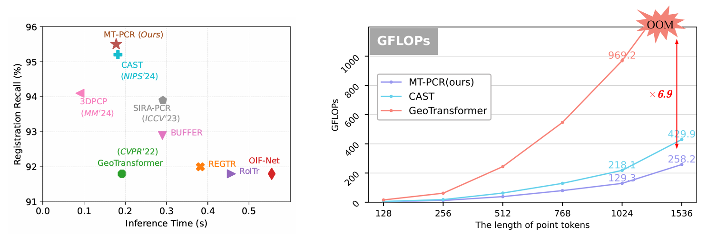
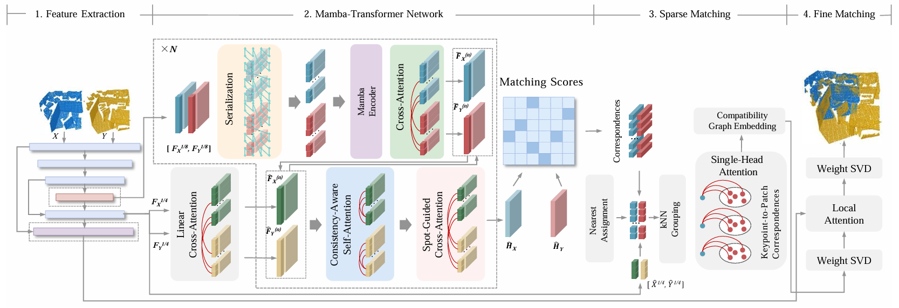
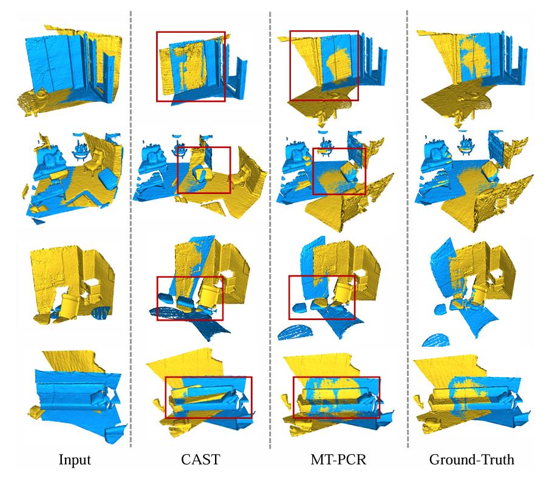

## MT-PCR: A Hybrid Mamba-Transformer with Spatial Serialization for Hierarchical Point Cloud Registration

Official PyTorch implementation of the paper [''MT-PCR: A Hybrid Mamba-Transformer with Spatial Serialization for Hierarchical Point Cloud Registration''](https://arxiv.org/pdf/2506.13183).

### 1. Introduction

We propose MT-PCR, the first point cloud registration framework that integrates both Mamba and Transformer modules. Specifically, we serialize point cloud features using Z-order space-filling curves to enforce spatial locality, enabling Mamba to better model the geometric structure of the input. Additionally, we remove the order indicator module commonly used in Mamba-based sequence modeling, leads to improved performance in our setting. The serialized features are then processed by an optimized Mamba encoder, followed by a Transformer refinement stage.  Extensive experiments on multiple benchmarks demonstrate that MT-PCR outperforms Transformer-based and concurrent state-of-the-art methods in both accuracy and efficiency, significantly reducing while GPU memory usage and FLOPs.



### 2. Installation

Please use the following command for installation.

```bash
# It is recommended to create a new environment
conda create -n mtpcr python==3.7
conda activate mtpcr

# Install packages and other dependencies
pip install -r requirements.txt

# If you are using CUDA 11.2 or newer, you can install `torch==1.7.1+cu110` or `torch=1.9.0+cu111`
pip install torch==1.9.0+cu111 -f https://download.pytorch.org/whl/torch_stable.html

# Install pytorch3d (feel free to download it to other directories)
conda install openblas-devel -c anaconda
wget https://github.com/facebookresearch/pytorch3d/archive/refs/tags/v0.6.2.zip
mv v0.6.2.zip pytorch3d-0.6.2.zip
unzip pytorch3d-0.6.2.zip
cd pytorch3d-0.6.2
pip install -e . 
cd ..

# Install MinkowskiEngine (feel free to download it to other directories)
git clone https://github.com/NVIDIA/MinkowskiEngine
cd MinkowskiEngine
python setup.py install --blas_include_dirs=${CONDA_PREFIX}/include --blas=openblas

# Install Mamba
(pointmamba) $ pip install causal-conv1d>=1.2.0
(pointmamba) $ cd mamba & pip install .

# Download pre-trained weights from release v1.0.0
```

Code has been tested with Ubuntu 20.04, GCC 9.4.0, Python 3.7, PyTorch 1.9.0, CUDA 11.2 and PyTorch3D 0.6.2.




### 5. 3DMatch and 3DLoMatch

#### Data preparation

The dataset can be downloaded from [PREDATOR](https://github.com/prs-eth/OverlapPredator) (by running the following commands):
```bash
wget --no-check-certificate --show-progress https://share.phys.ethz.ch/~gsg/pairwise_reg/3dmatch.zip
unzip 3dmatch.zip
```
The data should be organized as follows:
- `3dmatch`
    - `train`
        - `7-scenes-chess`
            - `fragments`
                - `cloud_bin_*.ply`
                - ...
            - `poses`
                - `cloud_bin_*.txt`
                - ...
        - ...
    - `test`
        - `7-scenes-redkitchen`
            - `fragments`
                - `cloud_bin_*.ply`
                - ...
            - `poses`
                - `cloud_bin_*.txt`
                - ...
        - ...

#### Training
After modifying the ```data.root``` item to your dataset path in ```./config/3dmatch.json```, you can use the following command for training.
```bash
python trainval.py --mode train --config ./config/3dmatch.json
```

#### Testing
After modifying the ```data.root``` item to your dataset path in ```./config/3dmatch.json```, you can use the following command for testing.
```bash
# evaluate the registration recall (CAST+RANSAC)
## for 3DMatch benchmark
python evaluate_RR.py --benchmark 3DMatch --config ./config/3dmatch.json --load_pretrained cast-epoch-05 --ransac
## for 3DLoMatch benchmark
python evaluate_RR.py --benchmark 3DLoMatch -config ./config/3dmatch.json --load_pretrained cast-epoch-05 --ransac

# evaluate the registration recall (CAST)
## for 3DMatch benchmark
python evaluate_RR.py --benchmark 3DMatch --config ./config/3dmatch.json --load_pretrained cast-epoch-05
## for 3DLoMatch benchmark
python evaluate_RR.py --benchmark 3DLoMatch --config ./config/3dmatch.json --load_pretrained cast-epoch-05

# evaluate IR, FMR, PIR, and PMR
## for 3DMatch benchmark
python evaluate_IR_FMR.py --benchmark 3DMatch --config ./config/3dmatch.json --load_pretrained cast-epoch-05
## for 3DLoMatch benchmark
python evaluate_IR_FMR.py --benchmark 3DLoMatch --config ./config/3dmatch.json --load_pretrained cast-epoch-05
```


#### Qualitative results
You can use the following command for visualization:
```bash
python demo_3dmatch.py --split test --benchmark 3DMatch --id 0
```



### 4. KITTI odometry

#### Data preparation

Download the data from the [KITTI official website](http://www.cvlibs.net/datasets/kitti/eval_odometry.php). The data should be organized as follows:
- `KITTI`
    - `velodyne` (point clouds)
        - `sequences`
            - `00`
                - `velodyne`
                    - `000000.bin`
                    - ...
            - ...
    - `results` (poses)
        - `00.txt`
        - ...
    - `sequences` (sensor calibration and time stamps)
        - `00`
            - `calib.txt`
            - `times.txt`
        - ...

Please note that we have already generated the information of pairwise point clouds via ``./data/gen_kitti_data.py``, which is stored in ``./data/kitti_list``. Feel free to use it directly or re-generate the information by yourselves.

#### Training
After modifying the ```data.root``` item to your dataset path in ```./config/kitti.json```, you can use the following command for training.
```bash
python trainval.py --mode train --config ./config/kitti.json
```

#### Testing
After modifying the ```data.root``` item to your dataset path in ```./config/kitti.json```, you can use the following command for testing.
```bash
python trainval.py --mode test --config ./config/kitti.json --load_pretrained cast-epoch-39
```

#### Qualitative results
You can use the following command for visualization:
```bash
# visualize the keypoints
python demo_outdoor.py --dataset kitti --mode keypts --load_pretrained cast-epoch-39 --split train --id 0
# visualize the keypoint correspondences
python demo_outdoor.py --dataset kitti --mode corr --load_pretrained cast-epoch-39 --split train --id 0
# visualize the aligned point clouds after pose estimation
python demo_outdoor.py --dataset kitti --mode reg --load_pretrained cast-epoch-39 --split train --id 0
```


### 5. nuScenes

#### Data preparation

Download the data from the [nuScenes official website](https://www.nuscenes.org/nuscenes#download). The data should be organized as follows:
- `nuscenes`
    - `samples`
        - `LIDAR_TOP`
            - `n008-2018-05-21-11-06-59-0400__LIDAR_TOP__1526915243047392.pcd.bin`
            - ...

#### Training
After modifying the ```data.root``` item to your dataset path in ```./config/nuscenes.json```, you can use the following command for training.
```bash
python trainval.py --mode train --config ./config/nuscenes.json
```

#### Testing
After modifying the ```data.root``` item to your dataset path in ```./config/nuscenes.json```, you can use the following command for testing.
```bash
python trainval.py --mode test --config ./config/nuscenes.json --load_pretrained cast-epoch-03-26000
```

#### Qualitative results
```bash
# visualize the keypoints
python demo_outdoor.py --dataset nuscenes --mode keypts --load_pretrained cast-epoch-03-26000 --split train --id 0
# visualize the keypoint correspondences
python demo_outdoor.py --dataset nuscenes --mode corr --load_pretrained cast-epoch-03-26000 --split train --id 0
# visualize the aligned point clouds after pose estimation
python demo_outdoor.py --dataset nuscenes --mode reg --load_pretrained cast-epoch-03-26000 --split train --id 0
```

### 6. Generalization and Adaptation to ETH

#### Data preparation

This dataset can be downloaded [here](https://share.phys.ethz.ch/~gsg/3DSmoothNet/data/ETH.rar), which is organized as follows after unzipping it:
- `ETH`
    - `gazebo_summer`
        - `gt.log`
        - `overlapMatrix.csv`
        - `Hokuyo_0.ply`
        - `Hokuyo_?.ply`...
    - `gazebo_winter`
    - `wood_autmn`
    - `wood_summer`
#### Testing
After modifying the ```data.root``` item to your dataset path in ```./config/eth.json```, you can use the following command for testing.
```bash
python evaluate_eth.py
```
#### Training (Unsupervised Domain Adaptation)
You can use the following command for tuning the network in an unsupervised manner.
```bash
python finetune.py
```

## Acknowledgements
[D3Feat](https://github.com/XuyangBai/D3Feat.pytorch)  
[PREDATOR](https://github.com/prs-eth/OverlapPredator)  
[GeoTransformer](https://github.com/qinzheng93/GeoTransformer)  
[CAST](https://github.com/RenlangHuang/CAST) 
[PointMamba](https://github.com/LMD0311/PointMamba)
